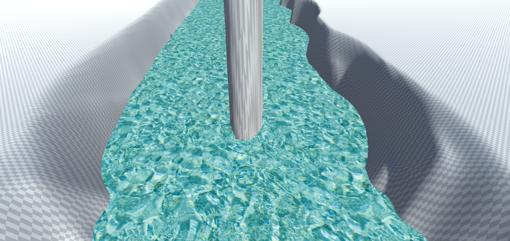

# UVスクロールと半透明

* 川をきれいに流そう
* 光を差し込ませよう

# 拡張した点

-
-
-
-
要望なのですが、数式だけではなくどのような操作やコードを書けば、このような結果になるといった説明をUnityを用い授業中にご説明いただきたいです。
すべての生徒が、今給黎先生のようにプログラムを理解しているわけではなく、多くの生徒が一からシェダーについて勉強していることをご理解いただきたいです。

# 進め方

- 本リポジトリをフォークしてください
- フォークしたリポジトリをcloneします
- Unityのプロジェクトを更新して実装してください。
- このテキストファイルに変更点を記載してください
- result.pngを自分の結果を保存して差し替えてください
- プルリクエストを出して提出してください
